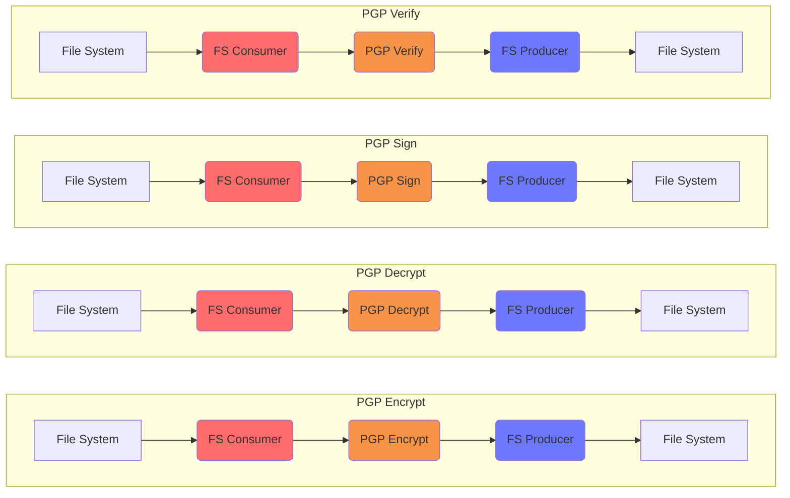

# PGP Testing

This project tests interlok-pgp features.

## What it does

This project contains various workflows that each demonstrates an interlok-pgp service.

Each workflow is made up of:

* A fs-consumer polling a given directory every 5 seconds
* A service from the interlok-pgp component that will perform an action
* A fs-producer which outputs the result to a file

## Getting started

* `./gradlew clean build`
* `(cd ./build/distribution && java -jar lib/interlok-boot.jar)`
* Generate a PGP key
* Load the config from this directory
  - Update the PGP public key location in the encrypt & verify workflows
  - Update the PGP private key location and passphrase in the decrypt &
    sign workflows
* Ensure that the directories are created (`messages/encrypt-in`, `messages/decrypt-in`, `messages/sign-in`, `messages/verify-in`)

## PGP Encrypt

* Copy a file into `messages/encrypt-in`
* Confirm that a PGP encrypted file is placed in `messages/decrypt-in`

## PGP Decrypt

* After encrypting a file, the decrypt workflow should then pick it up
  and decrypt it and place the result in `messages/decrypt-out`

## PGP Sign

* Copy a file into `messages/sign-in`
* Confirm that the file is placed into `messages/verify-in` with an
  inline signature

## PGP Verify

* After signing a file, the verify workflow should then pick it up and
  verify the inline signature, placing the result into
  `messages/verify-out`
